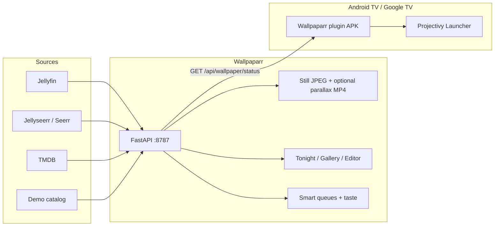

<p align="center">
  
</p>

<p align="center">
  <strong>Cinematic live wallpapers for Projectivy.</strong><br/>
  Stills and optional <em>parallax VIDEO</em> loops, generated from Jellyfin and Jellyseerr/Seerr,<br/>
  queued with taste, previewed as tonight’s home screen, served to the TV.
</p>

<p align="center">
  <a href="https://github.com/iManunator/projectivy-live-wallpaper-suite/actions/workflows/ci.yml"></a>
  <a href="https://github.com/iManunator/projectivy-live-wallpaper-suite/actions/workflows/release.yml"></a>
  <a href="https://github.com/iManunator/projectivy-live-wallpaper-suite/releases/latest"></a>
  <a href="https://github.com/iManunator/projectivy-live-wallpaper-suite/pkgs/container/wallpaparr"></a>
  <a href="LICENSE"></a>
  
</p>

<p align="center">
  <a href="#downloads">Downloads</a> ·
  <a href="#quick-start">Quick start</a> ·
  <a href="#features">Features</a> ·
  <a href="#architecture">Architecture</a> ·
  <a href="#api-contract">API</a> ·
  <a href="#wallpaparr-vs-seerchannel">vs SeerChannel</a> ·
  <a href="docs/INSTALL.md">Install</a> ·
  <a href="CHANGELOG.md">Changelog</a>
</p>

The GitHub repository is still named `projectivy-live-wallpaper-suite`. The product, image, plugin, and APK are **Wallpaparr** — an *arr-family* box that sits next to Jellyfin the way Sonarr sits next to usenet.

---

## Tonight, on your home screen

<p align="center">
  
</p>

<p align="center">
  <em>Placeholder capture of the Tonight page — 16:9 Projectivy chrome (clock, rows, dock) over a demo title. Swap for a PNG after <code>./scripts/verify.sh</code>.</em>
</p>

<table>
  <tr>
    <td width="50%"></td>
    <td width="50%"></td>
  </tr>
  <tr>
    <td align="center"><sub>Gallery — Unwatched / Continue / Requestable / VIDEO · pin · never-show</sub></td>
    <td align="center"><sub>Health — gallery size, cron, motion preset, taste, providers</sub></td>
  </tr>
</table>

| UI callout | What you are looking at |
| --- | --- |
| **Tonight** | Home page. Shuffle a taste pick, switch **layout DNA** (Netflix Hero, Prime Cinematic, Google TV Clean, Projectivy Dock), see the wallpaper *as the launcher will*. |
| **Gallery** | Every generated still. Click a still for a full-screen view. Badges for smart queues and baked VIDEO. Pin a title. Hide it forever. |
| **Editor** | Flagship 16:9 stage — linear/radial multi-stop gradients, vignette, overlays, edge fades, TV chrome, motion preview. Demo or Jellyfin artwork. Drag metadata; save persists the layout. |
| **Generate** | Demo catalog (real public-domain cinematic stills) or live Jellyfin/Seerr. Jellyfin batches download backdrop (then poster) art. Optional parallax VIDEO bake (ffmpeg). Connection/generate toasts. |
| **Dashboard** | Ops: last cron, provider config, queue counts. |
| **Settings** | Motion intensity, taste weights, overlays, cron. |

---

## Downloads

Durable artifacts live on **GitHub Releases** and **GHCR**. Actions artifacts expire; git does not carry APKs.

| Get | Link |
| --- | --- |
| **Plugin APK (primary)** | [`wallpaparr-plugin-release.apk`](https://github.com/iManunator/projectivy-live-wallpaper-suite/releases/latest/download/wallpaparr-plugin-release.apk) on the [latest GitHub Release](https://github.com/iManunator/projectivy-live-wallpaper-suite/releases/latest) |
| Debug APK | [`wallpaparr-plugin-debug.apk`](https://github.com/iManunator/projectivy-live-wallpaper-suite/releases/latest/download/wallpaparr-plugin-debug.apk) |
| **Container** | [`ghcr.io/imanunator/wallpaparr:latest`](https://github.com/iManunator/projectivy-live-wallpaper-suite/pkgs/container/wallpaparr) · also [`:1.1.0`](https://github.com/iManunator/projectivy-live-wallpaper-suite/pkgs/container/wallpaparr) |
| CI fallback | Green **CI** run → artifact `wallpaparr-plugin-apk` (same filenames; expires) |

```bash
docker pull ghcr.io/imanunator/wallpaparr:latest
adb install -r wallpaparr-plugin-release.apk
```

How GHCR + Release publishing works (permissions, future tags): **[docs/RELEASE.md](docs/RELEASE.md)**.

**v1.1.0 is published** — [Release](https://github.com/iManunator/projectivy-live-wallpaper-suite/releases/tag/v1.1.0) includes `wallpaparr-plugin-release.apk`; GHCR tags include `:latest`, `:v1.1.0`, and `:1.1.0`. Do not retag `v1.1.0`.

---

## Quick start

### 1. Server — one-liner (published image)

```bash
mkdir -p data && cp -n config.example.json data/config.json || true
docker run --name wallpaparr --restart unless-stopped -d -p 8787:8787 \
  -e PUBLIC_BASE_URL=http://YOUR_LAN_IP:8787 \
  -v "$PWD/data:/data" \
  ghcr.io/imanunator/wallpaparr:latest
```

### 2. Or Compose (always builds the Dockerfile — no GHCR required)

```bash
git clone https://github.com/iManunator/projectivy-live-wallpaper-suite.git
cd projectivy-live-wallpaper-suite
mkdir -p data
cp -n config.example.json data/config.json || true
cp .env.example .env          # PUBLIC_BASE_URL=http://YOUR_LAN_IP:8787 for the TV
docker compose up --build -d
```

`pull_policy: build` means Compose uses `Dockerfile` even if GHCR is empty. After a release you can `docker compose pull` instead. Offline demo verify: `./scripts/verify.sh`.

### 3. Prove it

```bash
curl -sf http://127.0.0.1:8787/api/health
# {"ok":true,"service":"wallpaparr","version":"1.1.0"}

curl -sf "http://127.0.0.1:8787/api/wallpaper/status?layout=Netflix%20Hero&profile=tonight"
curl -sf "http://127.0.0.1:8787/api/tonight?layout=Projectivy%20Dock"
curl -sf http://127.0.0.1:8787/api/dashboard
```

Open **http://127.0.0.1:8787** — Tonight is the home page. Empty data dirs auto-seed a demo catalog of **license-safe cinematic stills** (NASA aurora, NARA harbor/desert, Ortelius map, NASA Black Marble, Kew Palm House). **Northlight** is `sort=latest`. No Jellyfin keys required. Attribution: `backend/app/demo_stills/ATTRIBUTION.md`.

Unit tests (no Docker): `./scripts/test.sh`.

### 4. Plugin — Projectivy on the TV

1. Sideload [`wallpaparr-plugin-release.apk`](https://github.com/iManunator/projectivy-live-wallpaper-suite/releases/download/v1.1.0/wallpaparr-plugin-release.apk).
2. Projectivy → Appearance → Wallpaper → **Wallpaparr**.
3. Server URL: `http://YOUR_LAN_IP:8787` (not `127.0.0.1` — the TV has to reach it).
4. Pick mode **Tonight’s mix**. Enable **Prefer parallax / motion VIDEO** if you baked MP4s.

```bash
adb connect TV_IP
adb install -r wallpaparr-plugin-release.apk
```

Package `com.imanunator.wallpaparr` · UUID `dba9a12f-6252-4172-b5a3-8668d0523afb`

---

## Features

| Feature | What you get |
| --- | --- |
| **Tonight preview** | See the wallpaper inside Projectivy chrome before it hits the TV. Shuffle the taste mix. Switch layout DNA live. |
| **Layout DNA** | Netflix Hero, Prime Cinematic, Google TV Clean, **Projectivy Dock** (clock / row / dock safe zones), plus custom layouts. |
| **Smart queues** | Unwatched · Continue watching · Newly added · Seerr trending · Requestable · Pinned. Gallery badges match the queues. |
| **Parallax motion** | Optional H.264 loops: parallax / Ken Burns / drift · Subtle / Cinematic / Bold · light-leak layer. JPEG still always kept. |
| **Taste profiles** | `tonight` · `unwatched_heavy` · `cinephile` · `discovery` — weighted mixes, editable, `profile=` / `pool=taste:<name>`. |
| **Plugin pick modes** | Tonight’s mix, continue watching, newly added, Seerr trending, pinned, plus sort / pool / mix / round-robin from tvbgsuite. |
| **Demo mode** | Six fixture titles, no Jellyfin. `./scripts/verify.sh` builds the image, waits for health, curls status. |
| **Pin / never-show** | Hidden titles never enter `/api/wallpaper/status`. Pinned pool does not silently fall back. |
| **Overlays** | Off by default. Optional clock card + HA / news / JSON hooks. |
| **Jellyfin artwork** | Generate fetches Backdrop, then Primary. The editor previews the same art in-page via `/api/media/artwork/{id}`. |
| **Cron** | skip / replace / cleanup / ids / motion — generate while you sleep. |

---

## Architecture



| Piece | Path | Role |
| --- | --- | --- |
| Backend | `backend/` | Generate, catalog, queues, taste, cron, Projectivy HTTP API |
| Web UI | `web/` | Tonight preview, gallery, layout editor, generate, health, settings |
| Plugin | `plugin/` | Projectivy wallpaper provider `com.imanunator.wallpaparr` |
| Image | `Dockerfile` | `ghcr.io/imanunator/wallpaparr` — Python + ffmpeg + built UI |

---

## API contract

Compatible with the older TV Background Suite plugin (`imageUrl`, `actionUrl`, `path`; optional `mediaType` / `videoUrl`). Additive fields: `parallaxStyle`, `motionDuration`, `queue`, `pinned`. Full tables: **[docs/API.md](docs/API.md)**.

| Method | Path | Purpose |
| --- | --- | --- |
| `GET` | `/api/health` | `{ ok, service: "wallpaparr", version }` |
| `GET` | `/api/wallpaper/status` | Next wallpaper. Query: `layout`, `sort`, `pool`, `queue`, `profile`, `exclude`, filters |
| `GET` | `/api/tonight` | Taste pick + queues + motion snapshot for the Tonight UI |
| `GET` | `/api/dashboard` | Gallery size, last cron/generate, providers |
| `GET` | `/api/gallery` | Catalog. `POST /api/gallery/{id}/flag` pins or hides |
| `GET` | `/api/media` | Live provider preview (`source=jellyfin` / `demo` / `jellyseerr`) |
| `GET` | `/api/media/artwork/{id}` | Same-origin Jellyfin backdrop/poster proxy for the editor |
| `GET` | `/api/queues` | Smart-queue counts |
| `GET` | `/api/options` | Pick modes, pools, motion, taste, queues, clients |
| `POST` | `/api/generate` | Batch stills from provider artwork (+ optional VIDEO) |
| `GET`/`POST` | `/api/settings` | Providers, cron, motion, taste, overlays |

`GET /api/wallpaper/status?layout=Netflix%20Hero&profile=tonight` is the call the plugin makes for **Tonight’s mix**.

<details>
<summary>Example status payload</summary>

```json
{
  "imageUrl": "http://host:8787/api/wallpaper/image/Netflix%20Hero/northlight-demo.jpg",
  "videoUrl": "http://host:8787/api/wallpaper/image/Netflix%20Hero/northlight-demo.mp4",
  "mediaType": "video",
  "actionUrl": "jellyfin://items/…",
  "title": "Northlight",
  "path": "northlight-demo.jpg",
  "layout": "Netflix Hero",
  "parallaxStyle": "parallax",
  "motionDuration": 6.0,
  "queue": "unwatched",
  "pinned": false
}
```

</details>

---

## Wallpaparr vs SeerChannel

| | **Wallpaparr** (this repo) | **[SeerChannel](https://github.com/iManunator/SeerChannel)** |
| --- | --- | --- |
| Job | **Wallpaper** — the 16:9 plate behind the launcher | **Preview Channels** — the rows *on* the home screen |
| Install | Docker image + Projectivy wallpaper plugin APK | Separate Android app |
| Talks to | Jellyfin / Seerr / TMDB / demo catalog | Jellyfin / Jellyseerr directly |
| Bundled here? | Yes | **No** |

Install both if you want cinematic backgrounds *and* home-screen rows. They do not replace each other.

---

## Docs

| Doc | Contents |
| --- | --- |
| [Install](docs/INSTALL.md) | Server, plugin, LAN URL, migration from tvbgsuite |
| [Release / GHCR / APK](docs/RELEASE.md) | How `:latest` publishes, how to tag `v1.1.0`, permissions |
| [Verify](docs/VERIFY.md) | Demo mode, no Jellyfin, no GHCR |
| [API](docs/API.md) | Status contract + editor/ops endpoints |
| [Motion](docs/MOTION.md) | IMAGE vs VIDEO, parallax bake, intensity |
| [Overlays](docs/OVERLAYS.md) | Clock / HA / news hooks |
| [Projectivy plugin](docs/PROJECTIVY.md) | Pick modes, UUID, deep links |
| [Changelog](CHANGELOG.md) | Unreleased · 1.1.0 · 1.0.0 |

---

## Credits

- Projectivy wallpaper plugin contract: [spocky/projectivy-plugin-wallpaper-provider](https://github.com/spocky/projectivy-plugin-wallpaper-provider)
- Prior WebGUI / plugin work: [androidtvbackgroundWebGui](https://github.com/iManunator/androidtvbackgroundWebGui), [projectivy-tvbgsuite-plugin](https://github.com/iManunator/projectivy-tvbgsuite-plugin)
- Channels (separate): [SeerChannel](https://github.com/iManunator/SeerChannel)

MIT © 2026 iManunator
